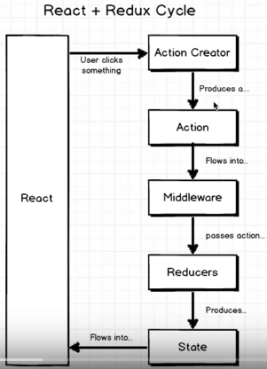

# React + Redux Study


## Install
```
  create-react-app .
  npm i -S redux react-redux
```


## Topic
- Store, reducer, action

- Redux devtools

- Access Redux store in React componet: Provider, connect()
```
    <Provider store={store}>
        <App />
    </Provider>,
```
In App.js
```
const mapStateToProps = (state) =>{
  return state;
}
const mapActionsToProps = { 
  onUpdateUser: updateUser
}

// if want to use props
const mapActionsToProps2 = (dispatch, props) => {
  return bindActionCreators({
    onUpdateUser: updateUser
  }, dispatch);  
}

const mergeProps = (propsFromState, propsFromDispath, ownProps) => {
  console.log(propsFromState, propsFromDispath, ownProps)
}

export default connect(mapStateToProps, mapActionsToProps, mergeProps)(App);
```

mapStateToProps: receives the state of the store then map the data into props
mapActionsToProps: dispatch actions in component

- API request Redux Thunk
The problem is : App fetch data asynchronouly, we need to create action when the request result is ready.
```
export function fetchData()
{
  const request = axios.get("the url");
  // Vanilla redux expect to return an action, but the data is not ready
  return {
      type: 'FETCH_DATA',
      playload: data
  }; 
  // redux thunk can accept the return value as a function
  return (dispatch) => {
      request.then(({data}) =>{
        dispath({
          type: 'FETCH_DATA',
          playload: data
        })
      });
  }
}
```
Redux Thunk is the community-standard method for handling long-running action creators in Redux applications. 

```
```